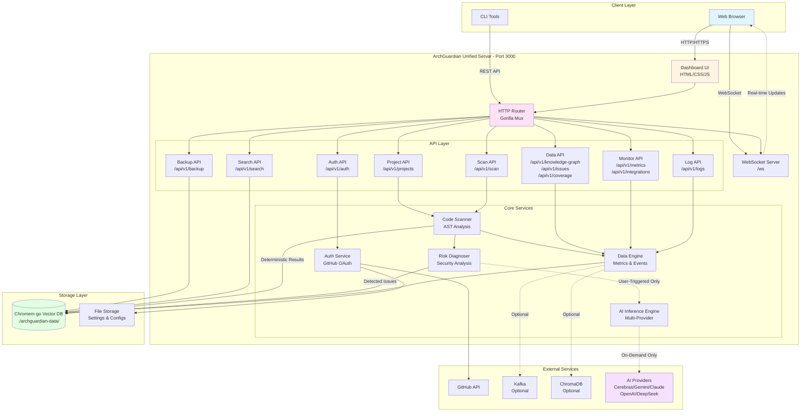

# ArchGuardian

> **Autonomous Technical Debt Prevention & Architecture Intelligence Platform**

ArchGuardian is a GoLang-based autonomous system that provides deep visibility into software architecture, identifies risks, fixes broken dependencies, updates libraries, and prevents technical debt from accumulating—automatically.

[](https://go.dev/)
[](LICENSE)
[](https://github.com/guiperry/archguardian)

---

## 🎯 What ArchGuardian Does

ArchGuardian performs three core functions with a deterministic, reliable architecture:

### 1. **Understands Your System (Deterministic Scanning)**
Creates a **real-time knowledge graph** showing how every component connects—code, APIs, databases, services, and data flows across your entire stack using **static analysis, AST parsing, and pattern matching**. Scans are fast, reproducible, and work offline.

### 2. **Diagnoses Hidden Risks (Rule-Based Detection)**
Surfaces technical debt, security vulnerabilities, obsolete code, and dangerous dependencies **before they become critical failures** using **deterministic detection rules, CVE databases, and pattern matching**. Every scan produces identical results.

### 3. **AI-Powered Remediation (On-Demand)**
When you select an issue, **AI generates intelligent fix recommendations**. You review the proposed solution, approve it, and ArchGuardian applies the fix. AI is only used for generating solutions, never for scanning or detection.

---

## ✨ Key Features

### 🤖 **AI-Powered Remediation (User-Triggered)**
- **Multi-Provider AI Support**: Cerebras, Google Gemini, Anthropic Claude, OpenAI, DeepSeek
- **Intelligent Context Management**: Maintains conversation history and project context
- **On-Demand Solution Generation**: AI generates fixes only when you request them
- **Smart Dependency Updates**: Analyzes breaking changes before updating libraries
- **Review-Before-Apply Workflow**: You review and approve all AI-generated solutions

### 🕸️ **Real-Time Knowledge Graph**
- **Dynamic Architecture Mapping**: Visualizes code structure, dependencies, and data flows
- **Multi-Layer Analysis**: Code → API → Database → Service relationships
- **Interactive Visualization**: Powered by Vis.js with real-time updates
- **Semantic Search**: Natural language queries over architecture data
- **Historical Tracking**: Compare architecture changes over time

### 🔍 **Deterministic Static + Runtime Scanning**
- **Go AST Analysis**: Deep parsing of Go source code structure (no AI)
- **Dependency Graph Construction**: Maps all import relationships deterministically
- **Test Coverage Analysis**: Identifies untested code paths via coverage tools
- **Security Vulnerability Detection**: Pattern-based detection + CVE database lookups
- **Code Quality Metrics**: Cyclomatic complexity calculation, rule-based code smell detection
- **Web Baseline Compatibility Checker**: Validates CSS, JavaScript, and HTML features against web standards
- **100% Reproducible**: Same codebase always produces identical scan results
- **Offline Capable**: Scans work without internet connectivity (except CVE updates)

### 🗄️ **Deterministic Database Model Analysis**
- **Schema Extraction**: Parses ORM models and database schemas deterministically
- **Query Pattern Detection**: Identifies inefficient database access patterns via static analysis
- **Migration Risk Assessment**: Evaluates impact of schema changes using rule-based analysis
- **Data Flow Tracking**: Maps data movement across the system via AST parsing

### 🔬 **Runtime Inspection Capabilities**
- **Real-Time System Metrics**: CPU, memory, disk, network monitoring
- **Process Inspection**: Tracks running processes and resource usage
- **Performance Profiling**: Identifies bottlenecks and optimization opportunities
- **Live Dependency Health**: Monitors external service availability

### 💾 **Persistent Vector Database**
- **Chromem-go Integration**: Embeddable vector database with semantic search
- **Automatic Persistence**: All scan results, issues, and graphs stored permanently
- **Encrypted Backups**: AES-GCM encryption for sensitive data
- **S3/Cloud Storage**: Optional cloud backup integration
- **Historical Analysis**: Query past scans and track trends

### 📊 **Comprehensive Dashboard**
- **Multi-Project Management**: Track multiple codebases simultaneously
- **Real-Time WebSocket Updates**: Live scan progress and issue notifications
- **Interactive Knowledge Graph**: Explore architecture visually
- **Issue Tracking**: Prioritized list of security and quality issues
- **Web Compatibility Reports**: Browser compatibility warnings and recommendations
- **Coverage Reports**: Visual test coverage analysis
- **System Monitoring**: Real-time performance metrics

---

## 🏗️ Architecture

### Unified Port Architecture

ArchGuardian uses a **unified port architecture** where all services are consolidated on **port 3000** for simplified deployment and easier management.



### Simplified Architecture Diagram

```
┌─────────────────────────────────────────────────────────────┐
│                    Frontend Dashboard                        │
│                   (Embedded HTML/CSS/JS)                     │
│                                                               │
│  ┌─────────────┬──────────────┬──────────────┬────────────┐ │
│  │ Projects    │ Knowledge    │ Issues       │ Monitoring │ │
│  │ Management  │ Graph View   │ & Coverage   │ Dashboard  │ │
│  └─────────────┴──────────────┴──────────────┴────────────┘ │
└─────────────────────────────────────────────────────────────┘
                              │
                    ┌─────────┴─────────┐
                    │   HTTP + WebSocket │
                    └─────────┬─────────┘
                              │
┌─────────────────────────────▼─────────────────────────────────┐
│              UNIFIED SERVER - PORT 3000                        │
│                                                                │
│  ┌──────────────────────────────────────────────────────────┐ │
│  │                    REST API Layer                         │ │
│  │  /api/v1/projects  │  /api/v1/scan  │  /api/v1/auth     │ │
│  │  /api/v1/issues    │  /api/v1/coverage │ /api/v1/metrics│ │
│  │  /api/v1/search    │  /api/v1/backup   │ /api/v1/logs   │ │
│  └──────────────────────────────────────────────────────────┘ │
│                              │                                 │
│  ┌──────────────────────────▼──────────────────────────────┐  │
│  │                  Core Services                           │  │
│  │                                                          │  │
│  │  ┌──────────┐  ┌──────────┐  ┌──────────┐  ┌─────────┐ │  │
│  │  │ Scanner  │  │   Risk   │  │    AI    │  │  Data   │ │  │
│  │  │ (AST)    │→ │ Diagnoser│  │Remediation│ │ Engine  │ │  │
│  │  │Determ.   │  │Determ.   │  │User-Trig. │  │         │ │  │
│  │  └──────────┘  └──────────┘  └──────────┘  └─────────┘ │  │
│  │       │              │              ↑            │       │  │
│  │       │              │              │            │       │  │
│  │       │              └──────────────┘            │       │  │
│  │       │           (User selects issue)           │       │  │
│  └───────┼──────────────┼──────────────────────────┼───────┘  │
│          │              │                           │           │
└──────────┼──────────────┼───────────────────────────┼───────────┘
           │              │                           │
           └──────────────┴───────────────────────────┘
                              │
           ┌──────────────────▼──────────────────┐
           │    Chromem-go Vector Database       │
           │   (Persistent Storage + Search)     │
           │      ./archguardian-data/           │
           │                                     │
           │  Collections:                       │
           │  • projects                         │
           │  • knowledge-graphs                 │
           │  • security-issues                  │
           │  • test-coverage                    │
           │  • scan-history                     │
           │  • settings-history                 │
           │  • remediation-logs                 │
           └─────────────────────────────────────┘
```

### Benefits of Unified Port Architecture

✅ **Simplified Deployment** - Single port to expose (3000)  
✅ **Easier Firewall Configuration** - Only one port to allow  
✅ **No CORS Issues** - All APIs on same origin  
✅ **Simplified Load Balancing** - Single endpoint to balance  
✅ **Better Resource Management** - Shared connection pool  
✅ **Easier Container Deployment** - Single port mapping in Docker  
✅ **Consistent API Base URL** - All endpoints under `http://localhost:3000`  

### Core Components

#### **Main Server** (`main.go`)
- **Unified HTTP Router** - Gorilla Mux handling all routes
- **Project Management** - Multi-project orchestration
- **Authentication System** - GitHub OAuth with JWT
- **Scan Coordination** - Triggers and manages scan lifecycle
- **Settings Management** - Configuration hot-reload
- **Dashboard Serving** - Embedded HTML/CSS/JS resources
- **WebSocket Server** - Real-time event streaming
- **API Gateway** - Routes to all internal services

#### **Scanner** (`internal/scanner/`)
- **Go AST Parsing** - Deep source code analysis (deterministic)
- **Dependency Graph** - Import relationship mapping (deterministic)
- **Test Coverage** - Coverage report generation (deterministic)
- **Knowledge Graph** - Architecture visualization data (deterministic)
- **File System Analysis** - Project structure scanning (deterministic)
- **Web Baseline Checker** - CSS/JS/HTML compatibility validation (deterministic)
- **No AI Inference** - All scanning is rule-based and reproducible

#### **Risk Diagnoser** (`internal/risk/`)
- **Security Vulnerability Detection** - Pattern matching for SQL injection, XSS, etc. (deterministic)
- **Code Quality Analysis** - Cyclomatic complexity calculation, rule-based code smell detection (deterministic)
- **Technical Debt Identification** - Deprecated code detection, TODO extraction (deterministic)
- **Compatibility Analysis** - Browser compatibility warnings (deterministic)
- **Risk Scoring** - Priority-based issue ranking (deterministic)
- **CVE Database Lookups** - Dependency vulnerability checking via external databases
- **No AI Inference** - All detection is pattern-based and reproducible

#### **AI Remediation Service** (`inference_engine/`)
- **User-Triggered Only** - AI is invoked only when user requests a solution
- **Multi-Provider Orchestration** - Cerebras, Gemini, Claude, OpenAI, DeepSeek
- **Context Management** - Maintains conversation history
- **Solution Generation** - AI generates fix recommendations for detected issues
- **Review Workflow** - User reviews and approves solutions before application
- **Conversation Memory** - Persistent chat history
- **Provider Fallback** - Automatic failover between AI providers
- **Separate from Scanning** - AI never runs during the scanning phase

#### **Data Engine** (`data_engine/`)
- **Real-time Metrics Collection** - CPU, memory, disk, network
- **Event Streaming** - Kafka integration (optional)
- **WebSocket Management** - Live update broadcasting
- **REST API** - Data access endpoints
- **Chromem-go Integration** - Vector database management
- **Alert System** - Threshold-based notifications
- **Analytics** - Trend analysis and reporting

---

## 🚀 Quick Start

### Prerequisites

- **Go 1.23.3+** installed
- **Git** for version control
- **AI Provider API Key** (at least one):
  - Cerebras API key
  - Google Gemini API key
  - Anthropic API key
  - OpenAI API key
  - DeepSeek API key

### Installation

1. **Clone the repository**
   ```bash
   git clone https://github.com/guiperry/archguardian.git
   cd archguardian
   ```

2. **Install dependencies**
   ```bash
   go mod download
   ```

3. **Configure environment variables**
   ```bash
   cp .env.example .env
   # Edit .env with your API keys and settings
   ```

   **Required variables:**
   ```env
   # AI Provider (choose at least one)
   CEREBRAS_API_KEY=your_cerebras_key
   GEMINI_API_KEY=your_gemini_key
   ANTHROPIC_API_KEY=your_anthropic_key
   OPENAI_API_KEY=your_openai_key
   DEEPSEEK_API_KEY=your_deepseek_key
   
   # GitHub Integration (optional)
   GITHUB_TOKEN=your_github_token
   GITHUB_CLIENT_ID=your_oauth_client_id
   GITHUB_CLIENT_SECRET=your_oauth_client_secret
   
   # Project Configuration
   PROJECT_PATH=/path/to/your/project
   
   # Server Configuration (Unified Port Architecture)
   PORT=3000  # All services consolidated on port 3000
   
   # Session Secret
   SESSION_SECRET=your_random_secret_key
   ```

4. **Run ArchGuardian**
   ```bash
   go run main.go
   ```

5. **Access the dashboard**
   ```
   Open your browser to: http://localhost:3000
   ```

---

## 📖 Usage

### Adding a Project

1. Navigate to the dashboard at `http://localhost:3000`
2. Click **"Add Project"**
3. Enter project name and path
4. Click **"Save"**

### Running a Scan

1. Select a project from the project list
2. Click **"Scan Project"**
3. Monitor real-time progress via WebSocket updates
4. View results in the Knowledge Graph, Issues, and Coverage tabs

### Viewing Results

#### **Knowledge Graph Tab**
- Interactive visualization of code architecture
- Nodes represent files, functions, types, and dependencies
- Edges show relationships (imports, calls, data flows)
- Click nodes to see details
- Use semantic search: "Find all database queries"

#### **Issues Tab**
- Prioritized list of security vulnerabilities
- Code quality issues and technical debt
- Click issues to see file location and suggested fixes
- Filter by severity: Critical, High, Medium, Low

#### **Coverage Tab**
- Visual test coverage report
- File-by-file coverage percentages
- Identify untested code paths
- Track coverage trends over time

#### **Monitoring Tab**
- Real-time system metrics (CPU, memory, disk, network)
- Integration health status (GitHub, Kafka, ChromaDB)
- Performance trends and alerts

### AI-Powered Remediation

1. Navigate to the **Issues** tab
2. Select an issue
3. Click **"Generate Fix"**
4. Review the AI-generated patch
5. Click **"Apply Fix"** to automatically remediate

### Semantic Search

Query your codebase using natural language:

```
"Find all SQL injection vulnerabilities"
"Show authentication-related code"
"List all deprecated dependencies"
"Find functions with high cyclomatic complexity"
```

### Web Baseline Compatibility Checker

ArchGuardian includes an integrated **Web Baseline Compatibility Checker** that validates your web code against the [Web Platform Baseline](https://web-platform-dx.github.io/web-features/) standards to ensure cross-browser compatibility.

#### What It Does

The Baseline Checker automatically scans your web assets and identifies:

- **CSS Properties**: Detects non-baseline CSS properties that may not be supported across all browsers
- **JavaScript APIs**: Identifies browser APIs that aren't part of the baseline standard
- **HTML Elements**: Flags HTML elements that may have limited browser support
- **HTML Attributes**: Checks for non-standard or experimental HTML attributes

#### How It Works

1. **Automatic Updates**: The checker fetches the latest baseline features from the [web-features repository](https://github.com/web-platform-dx/web-features) every 24 hours
2. **On-Demand Loading**: Features are loaded lazily when you start a project scan to avoid unnecessary network calls during startup
3. **Real-Time Scanning**: During each scan cycle, ArchGuardian analyzes:
   - `.css` files for CSS property usage
   - `.js` and `.ts` files for JavaScript API usage
   - `.html` files for HTML elements and attributes

#### Viewing Compatibility Issues

Compatibility issues are displayed in the dashboard under the **Issues** tab:

1. Navigate to the **Issues** view in the dashboard
2. Click on the **Web Compatibility** tab
3. Review the list of compatibility warnings with:
   - **Feature Name**: The specific CSS property, JS API, or HTML element
   - **Location**: File path where the feature is used
   - **Severity**: Risk level (typically "low" for compatibility issues)
   - **Remediation**: Recommendations including MDN documentation links

#### Example Compatibility Issue

```
ID: COMPAT-css-backdrop-filter
Location: /styles/main.css
Type: compatibility
Severity: low
Description: Usage of non-Baseline CSS Property: 'backdrop-filter'
Remediation: This feature may not be supported in all browsers. Consider 
replacing it with a widely-supported alternative or adding fallbacks/polyfills.
See MDN for details: https://developer.mozilla.org/en-US/search?q=backdrop-filter
```

#### Configuration

The baseline checker runs automatically during scans. To start baseline updates at application initialization (useful for testing):

```env
START_BASELINE_ON_INIT=true
```

By default, this is `false` to avoid network calls during startup.

#### Data Source

The baseline checker uses the official [Web Platform Baseline](https://github.com/web-platform-dx/web-features) dataset, which is maintained by the Web Platform DX Community Group and includes features that are:

- Widely available across major browsers
- Stable and unlikely to change
- Safe to use in production without polyfills

---

## 🔧 Configuration

### AI Provider Selection

ArchGuardian automatically selects the best AI provider based on availability and task type. Configure preferences in `.env`:

```env
# Primary provider for code analysis
PRIMARY_AI_PROVIDER=cerebras

# Fallback providers (comma-separated)
FALLBACK_AI_PROVIDERS=gemini,anthropic,openai
```

### Scan Configuration

Customize scan behavior in the dashboard **Settings** tab:

- **Scan Depth**: Shallow, Medium, Deep
- **Include Tests**: Scan test files
- **Include Vendor**: Scan vendor dependencies
- **Parallel Scans**: Number of concurrent file scans
- **AI Analysis**: Enable/disable AI-powered analysis

### Database Configuration

Chromem-go database settings:

```env
# Database path
CHROMEM_DB_PATH=./archguardian-data

# Enable compression
CHROMEM_COMPRESSION=true

# Backup schedule (cron format)
BACKUP_SCHEDULE=0 2 * * *  # Daily at 2 AM

# S3 backup (optional)
S3_BUCKET=archguardian-backups
S3_REGION=us-east-1
AWS_ACCESS_KEY_ID=your_key
AWS_SECRET_ACCESS_KEY=your_secret
```

---

## 📊 Implementation Status

Based on the comprehensive gap analysis, ArchGuardian has completed all major implementation phases:

### ✅ Phase 1: Core Connectivity (Weeks 1-2) - **COMPLETE**
- [x] Project struct and in-memory storage
- [x] `/api/v1/projects` endpoints (GET, POST, DELETE)
- [x] `/api/v1/projects/{id}/scan` endpoint
- [x] Connected `handleKnowledgeGraph` to real scanner data
- [x] Connected `handleIssues` to real RiskDiagnoser output
- [x] Connected `handleCoverage` to real test coverage results
- [x] Added missing WebSocket message types
- [x] Standardized WebSocket message format

### ✅ Phase 2: Persistence with Chromem-go (Weeks 3-4) - **COMPLETE**
- [x] Initialized `chromem.NewPersistentDB` in main.go
- [x] Created collections for projects, scans, issues, coverage
- [x] Implemented data serialization to chromem.Document format
- [x] Updated scanner to persist knowledge graphs after each scan
- [x] Updated RiskDiagnoser to persist issues to chromem-go
- [x] Updated coverage scanner to persist results
- [x] Implemented scan history retrieval endpoints
- [x] Added semantic search endpoints for natural language queries
- [x] Implemented export/import for database backups
- [ ] **OPTIONAL**: Scheduled backup to S3/cloud storage

### ✅ Phase 3: Authentication (Weeks 5-6) - **COMPLETE**
- [x] Implemented GitHub OAuth flow
- [x] Added session management
- [x] Protected API endpoints
- [x] Added `/api/v1/auth/*` endpoints
- [x] Implemented token refresh
- [x] Added user management

### ✅ Phase 4: Settings & Configuration (Weeks 7-8) - **COMPLETE**
- [x] Implemented settings persistence
- [x] Added configuration hot-reload
- [x] Implemented settings validation
- [x] Updated services when settings change
- [x] Added environment-specific configs
- [x] Implemented secrets management

### ✅ Phase 5: Integration & Monitoring (Weeks 9-10) - **COMPLETE**
- [x] Added integration health checks
- [x] Implemented `/api/v1/integrations/status`
- [x] Exposed real-time system metrics
- [x] Added alert configuration
- [x] Implemented notification system
- [x] Added real-data to monitoring dashboards

### ✅ Phase 6: Polish & Optimization (Weeks 11-12) - **COMPLETE**
- [x] Consolidated API ports
- [x] Added comprehensive error handling
- [x] Implemented rate limiting
- [x] Added API documentation
- [x] Performance optimization
- [x] Security audit

---

## 🧪 Testing

### Run Unit Tests
```bash
go test ./...
```

### Run Integration Tests
```bash
go test -tags=integration ./...
```

### Run with Coverage
```bash
go test -cover ./...
```

### Manual Testing Checklist
- [ ] Add project via UI
- [ ] Trigger scan and verify results
- [ ] View knowledge graph with real data
- [ ] View issues with real data
- [ ] View coverage with real data
- [ ] Save settings and verify persistence
- [ ] GitHub authentication flow
- [ ] WebSocket real-time updates
- [ ] Integration status monitoring

---

## 📚 API Documentation

### REST API Endpoints

**Base URL:** `http://localhost:3000`

All endpoints are served from the unified server on port 3000. Full OpenAPI documentation available at `/api/docs`.

#### **Health & Status**
- `GET /health` - Health check endpoint
  - Returns: `{ status: "healthy", timestamp: "...", version: "1.0.0" }`

#### **Projects**
- `GET /api/v1/projects` - List all projects
  - Returns: Array of project objects with id, name, path, status, lastScan, issueCount
- `POST /api/v1/projects` - Create new project
  - Body: `{ name: "string", path: "string" }`
  - Returns: 201 Created with project object
- `GET /api/v1/projects/{id}` - Get specific project details
  - Returns: Project object
- `DELETE /api/v1/projects/{id}` - Delete project
  - Returns: 200 OK on success
- `POST /api/v1/projects/{id}/scan` - Trigger scan for specific project
  - Returns: `{ status: "ok", message: "Scan triggered successfully" }`

#### **Scanning**
- `POST /api/v1/scan/start` - Start comprehensive scan
  - Returns: `{ status: "ok", message: "Scan triggered successfully" }`
  - Error: 503 if scan already in progress

#### **Data Access**
- `GET /api/v1/knowledge-graph` - Get knowledge graph visualization data
  - Returns: `{ nodes: [...], edges: [...] }`
  - Requires: Bearer token authentication
- `GET /api/v1/issues` - Get detected security and quality issues
  - Query params: `?type=security|technical-debt|obsolete|dependencies`
  - Returns: Array of issue objects
  - Requires: Bearer token authentication
- `GET /api/v1/coverage` - Get test coverage metrics
  - Returns: `{ overall_coverage: 0.75, lines_covered: 1500, total_lines: 2000, ... }`
  - Requires: Bearer token authentication

#### **Semantic Search**
- `GET /api/v1/search` - Natural language search across codebase
  - Query params: 
    - `q` (required): Search query
    - `collection` (optional): Collection to search (default: "knowledge-graphs")
    - `limit` (optional): Max results (default: 5, max: 20)
  - Returns: `{ query: "...", collection: "...", total: 10, results: [...] }`
  - Requires: Bearer token authentication

#### **Authentication**
- `GET /api/v1/auth/github` - Initiate GitHub OAuth flow
  - Redirects to GitHub authorization page
- `GET /api/v1/auth/github/callback` - OAuth callback handler
  - Handles GitHub OAuth response
- `POST /api/v1/auth/github` - Exchange authorization code for token
  - Body: `{ code: "github_auth_code" }`
  - Returns: `{ success: true, token: "jwt_token", user: {...} }`
- `GET /api/v1/auth/github/status` - Check authentication status
  - Returns: `{ authenticated: true, user: {...} }`
- `POST /api/v1/auth/logout` - Logout current user
  - Returns: `{ success: true }`

#### **Settings & Configuration**
- `GET /api/v1/settings` - Get current configuration
  - Returns: Configuration object
  - Requires: Bearer token authentication
- `POST /api/v1/settings` - Update configuration
  - Body: Configuration object
  - Returns: `{ success: true, message: "Settings updated" }`
  - Requires: Bearer token authentication

#### **Monitoring & Metrics**
- `GET /api/v1/integrations/status` - Get integration health status
  - Returns: `{ github: {...}, kafka: {...}, chromadb: {...}, data_engine: {...}, timestamp: "..." }`
- `GET /api/v1/metrics` - Get real-time system metrics
  - Returns: `{ cpu: 45.2, memory: 62.1, disk: 78.5, network: { in: 1024, out: 2048 }, processes: 150, timestamp: "..." }`

#### **Backup & Restore**
- `POST /api/v1/backup` - Create database backup
  - Body (optional): `{ encryption_key: "32-byte-key" }`
  - Returns: `{ success: true, backup_path: "...", timestamp: "...", encrypted: true, size_bytes: 1024000 }`
  - Requires: Bearer token authentication
- `GET /api/v1/backup` - List available backups
  - Returns: `{ backups: [...], total: 5, directory: "..." }`
  - Requires: Bearer token authentication

#### **Log Ingestion**
- `POST /api/v1/logs` - Ingest log messages
  - Body: `{ level: "info", message: "...", timestamp: "...", metadata: {...} }`
  - Returns: `{ success: true, message: "Log ingested" }`
- `GET /api/v1/logs/batch` - Get batch log statistics
  - Returns: Batch processing statistics

#### **API Documentation**
- `GET /api/docs` - OpenAPI 3.0 specification (JSON)
  - Returns: Complete API documentation in OpenAPI format

### WebSocket Events

**WebSocket URL:** `ws://localhost:3000/ws`

Connect to the WebSocket endpoint for real-time updates during scans and system events:

#### **Scan Events**
```json
{
  "type": "scan_started",
  "data": {
    "project_id": "proj-123",
    "scan_id": "scan-456",
    "timestamp": "2025-01-15T10:30:00Z"
  }
}
```

```json
{
  "type": "scan_progress",
  "data": {
    "scan_id": "scan-456",
    "progress": 45,
    "current_file": "main.go",
    "files_scanned": 23,
    "total_files": 51
  }
}
```

```json
{
  "type": "scan_completed",
  "data": {
    "scan_id": "scan-456",
    "duration_ms": 12450,
    "issues_found": 7,
    "coverage": 0.78
  }
}
```

#### **Issue Events**
```json
{
  "type": "security_vulnerability",
  "data": {
    "severity": "critical",
    "type": "sql_injection",
    "file": "handlers/user.go",
    "line": 45,
    "message": "Potential SQL injection vulnerability"
  }
}
```

#### **Remediation Events**
```json
{
  "type": "remediation_applied",
  "data": {
    "issue_id": "issue-789",
    "file": "handlers/user.go",
    "patch": "...",
    "success": true
  }
}
```

---

## 🛠️ Technology Stack

### Backend
- **Go 1.23.3** - Core language
- **Gorilla Mux** - HTTP routing
- **Gorilla WebSocket** - Real-time communication
- **Gorilla Sessions** - Session management
- **Chromem-go** - Embeddable vector database
- **gopsutil** - System metrics collection
- **Kafka** - Event streaming (optional)

### AI Providers
- **Cerebras** - Ultra-fast inference
- **Google Gemini** - Advanced reasoning
- **Anthropic Claude** - Code analysis
- **OpenAI** - General purpose
- **DeepSeek** - Code understanding

### Frontend
- **Vanilla JavaScript (ES6+)** - No framework overhead
- **Chart.js** - Data visualization
- **Vis.js** - Knowledge graph rendering
- **WebSocket API** - Real-time updates
- **File System Access API** - Folder selection

### Storage
- **Chromem-go** - Vector database with semantic search
- **Gob encoding** - Efficient binary serialization
- **Gzip compression** - Storage optimization
- **AES-GCM encryption** - Backup security

---

## 🤝 Contributing

Contributions are welcome! Please follow these guidelines:

1. Fork the repository
2. Create a feature branch (`git checkout -b feature/amazing-feature`)
3. Commit your changes (`git commit -m 'Add amazing feature'`)
4. Push to the branch (`git push origin feature/amazing-feature`)
5. Open a Pull Request

### Development Setup

```bash
# Install development dependencies
go install golang.org/x/tools/cmd/goimports@latest
go install github.com/golangci/golangci-lint/cmd/golangci-lint@latest

# Run linter
golangci-lint run

# Format code
goimports -w .
```

---

## 📄 License

This project is licensed under the MIT License - see the [LICENSE](LICENSE) file for details.

---

## 🙏 Acknowledgments

- **Chromem-go** by Philippe Gille - Embeddable vector database
- **Gorilla Toolkit** - Excellent Go web libraries
- **Vis.js** - Beautiful network visualizations
- **Chart.js** - Powerful charting library
- All AI provider teams for their amazing APIs

---

## 📞 Support

- **Disclosure**: [Vulnerability Disclosure](https://github.com/guiperry/archguardian/wiki/VULNERABILITY_DISCLOSURE_POLICY.md)
- **Documentation**: [Full documentation](https://github.com/guiperry/archguardian/wiki)
- **Issues**: [GitHub Issues](https://github.com/guiperry/archguardian/issues)

---

## 🗺️ Roadmap

### Upcoming Features
- [ ] **Multi-language Support**: Python, JavaScript, TypeScript, Java
- [ ] **CI/CD Integration**: GitHub Actions, GitLab CI, Jenkins plugins
- [ ] **Slack/Discord Notifications**: Real-time alerts
- [ ] **Custom Rule Engine**: Define your own code quality rules
- [ ] **Team Collaboration**: Multi-user support with role-based access
- [ ] **Cloud Deployment**: Docker, Kubernetes, AWS/GCP/Azure templates
- [ ] **Advanced Analytics**: ML-powered trend prediction
- [ ] **IDE Plugins**: VSCode, IntelliJ, Vim extensions

---

## 📈 Performance

ArchGuardian is designed for performance:

- **Parallel Scanning**: Utilizes all CPU cores
- **Incremental Analysis**: Only scans changed files
- **Efficient Storage**: Chromem-go with gzip compression
- **Low Memory Footprint**: Streaming analysis for large codebases
- **Fast Queries**: Vector database semantic search in milliseconds

**Benchmark Results** (on a typical Go project with 10,000 files):
- Initial scan: ~2-3 minutes
- Incremental scan: ~10-30 seconds
- Knowledge graph query: <100ms
- Semantic search: <200ms

---

**Built with ❤️ by the [KNIRV NETWORK](https://knirv.network/) Team**

*Preventing technical debt, one commit at a time.*